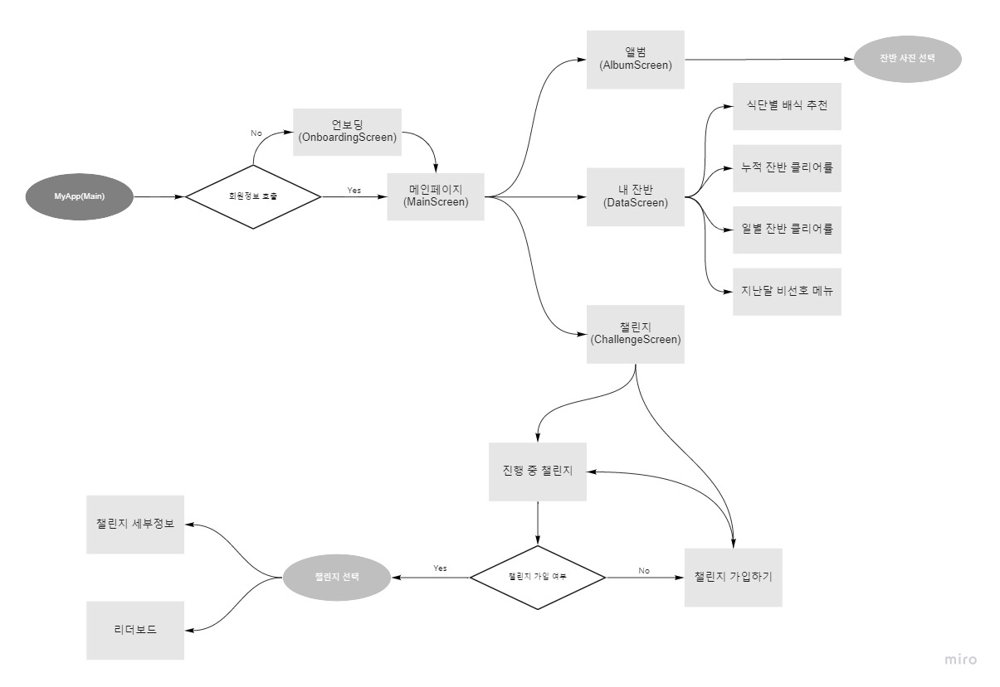
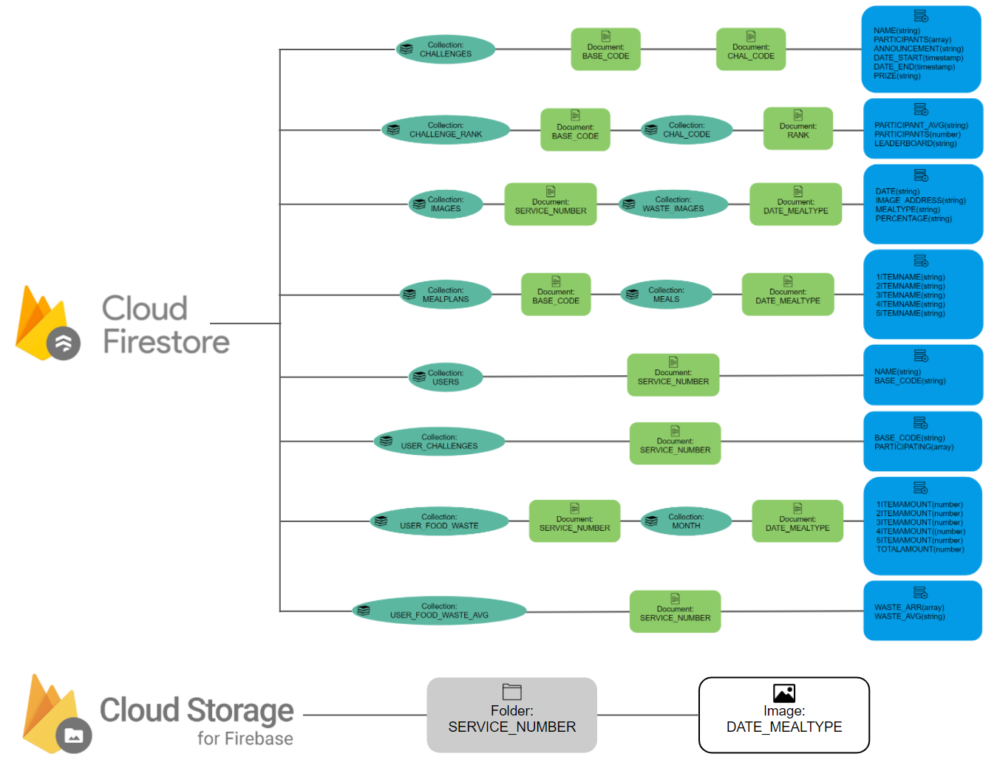

# MealScan - APP (Android) - Flutter

## Frontend

### 유저 플로우

<table>
    <tr>
        <td width="100%">
            
        </td>
    </tr>
    <tr>
        <td align="center">
            <a>User Flowchart (via Miro)</a>
        </td>
    </tr>
</table>

### 주요 Directory 분류
* Components:\
&nbsp; - challenge_components: 챌린지 스크린에 들어가는 컴포넌트 모음\
&nbsp; - data_components: Explore data 스크린에 들어가는 컴포넌트 모음\
&nbsp; - login_components: 로그인 스크린에 들어가는 컴포넌트 모음\
&nbsp; - onboarding_components: 온보딩 화면에 들어가는 컴포넌트 모음

* Screens:\
&nbsp; - album_screens: 앨범 탭에 들어가는 스크린 (앨범 피드, 사진별 페이지)\
&nbsp; - challenge_screens: 챌린지 탭에 들어가는 스크린 (참가 중/진행 중 챌린지 탭버튼에 따른 스크린, 참가 중 정보 스크린, 진행 중 정보 스크린)\
&nbsp; - onboarding_screens (온보딩 메인 스크린, 온보딩 가입정보 스크린)\

* Models:\
&nbsp; - challenge: 챌린지 클래스 모델링\
&nbsp; - user: 유저 클래스 모델링

### 사용 중인 오픈소스 Dependency 모음

|사용한 오픈소스 패키지|용도 
|:---:|:---:|
|[font_awesome_flutter (^9.0.0)](https://pub.dev/packages/font_awesome_flutter)| 아이콘 사용
|[fl_chart (^0.40.0)](https://pub.dev/packages/fl_chart)| Explore를 위한 데이터 시각화
|[animated_widgets (^1.1.0)](https://pub.dev/packages/animated_widgets) | 챌린지 및 데이터 화면에서 아이콘 탭 유도
|[cool_stepper (^1.2.1)](https://pub.dev/packages/cool_stepper) | 온보딩 화면 제작
|[flutter_swiper_plus (^2.04)](https://pub.dev/packages/flutter_swiper_plus) | 데이터 화면 갤러리 형태의 배식추천
|[carousel_slider (^4.0.0)](https://pub.dev/packages/carousel_slider) | 온보딩 첫 화면 튜토리얼
|[photo_view (^0.13.0)](https://pub.dev/packages/photo_view) | 앨범 포토 뷰어
|[syncfusion_flutter_gauges (^19.3.45)](https://pub.dev/packages/syncfusion_flutter_gauges) | 앨범 포토 뷰어
|[intl (^0.17.0)](https://pub.dev/packages/intl) | DateFormat 이용
 

## Backend

### Database 플로우

<table>
    <tr>
        <td width="100%">
            
        </td>
    </tr>
    <tr>
        <td align="center">
            <a>Firebase Structure</a>
        </td>
    </tr>
</table>

### 주요 Collection 분류
* Firebase Firestore\
&nbsp; - CHALLENGES: 현재 진행되고 있는 챌린지 정보 모음\
&nbsp; - CHALLENGE_RANK: 챌린지 별 순위표, 참가자 별 잔반량 모음\
&nbsp; - IMAGES: Cloud Storage에 들어가있는 사진들의 링크 및 정보 모음\
&nbsp; - MEALPLANS: 각 급양대 별 메뉴 정보 모음\
&nbsp; - USERS: 유저 정보 모음\
&nbsp; - USER_CHALLENGES: 유저 별 참여하고 있는 챌린지 정보 모음\
&nbsp; - USER_FOOD_WASTE: 유저 별 잔반량 정보 모음
&nbsp; - USER_FOOD_WASTE: 유저 별 잔반량 정보 평균 모음

* Firebase Cloud Storage\
&nbsp; - FOLDER(SERVICE_NUMBER): 군번 별 폴더를 통해 잔반 식판 사진 모음

### 사용 중인 오픈소스 Dependency 모음

|사용한 오픈소스 패키지|용도 
|:---:|:---:|
|[provider (^5.0.0)](https://pub.dev/packages/provider)| 추가 / 삭제된 챌린지 트래킹
|[firebase_core(^1.7.0)](https://pub.dev/packages/firebase_core)| Firebase 프로젝트 연동
|[firebase_web(^5.0.9)](https://pub.dev/packages/firebase_web)| Firebase Web 연동 및 테스트 
|[cloud_firestore(^2.5.3)](https://pub.dev/packages/cloud_firestore)| Firebase Firestore DB 연동
