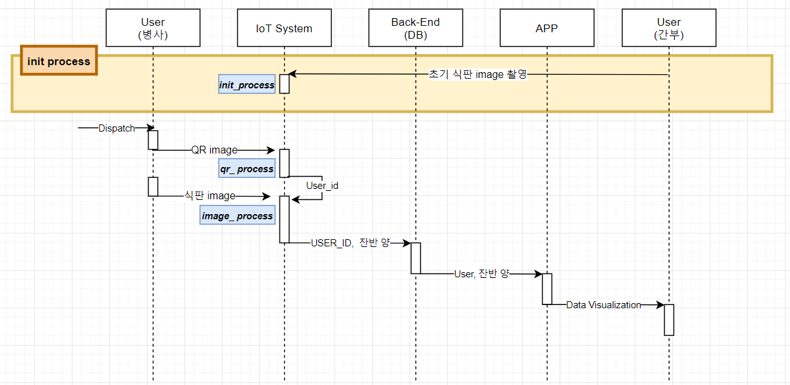

<h1>IoT 부분</h1>
장병들의 잔반을 측정하고 Back-End 서버 DB에 데이터를 넣어주는 IoT System

 
<h2> Process 구조 </h2>
<h3>Main</h3>
<h3>init_processing</h3>
<h3>image_processing</h3>
<h3>qr_processing</h3>
<h3>utill & database</h3>
 
<h2> Jupyter Notebook(colab) </h2>
<h3>음식 분류 알고리즘 및 양 측정 알고리즘 테스트</h3>
 
  
 
 
 
  

Jupyter Notebook을 직접 실행하려면, Colab에서 [Jupyter Notebook](https://github.com/osamhack2021/APP_IOT_AI_Meal-Mil-Scan_FOODFIGHTERS/blob/master/osam2021_raspi/test_ImageProcess%20.ipynb) 를 실행하세요!
<h2> Sequence Diagram </h2>

