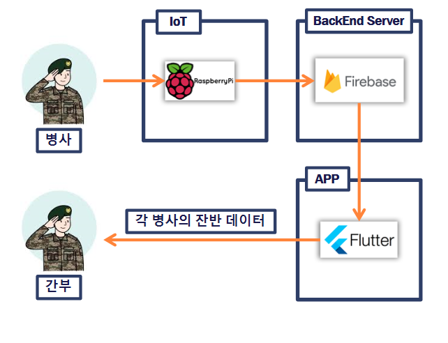
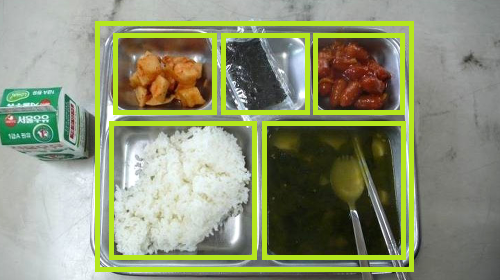
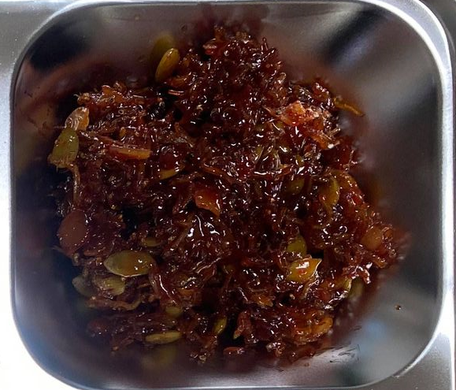
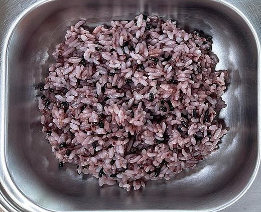
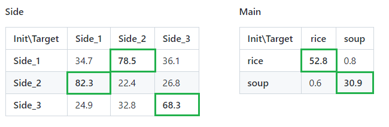
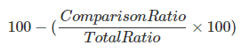
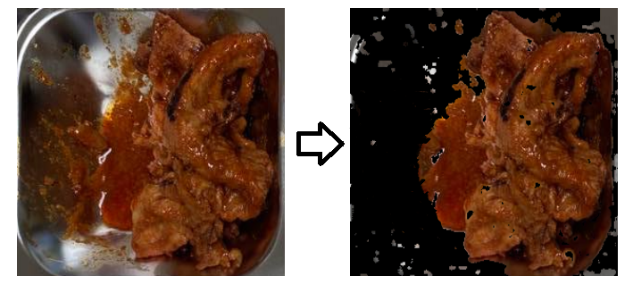
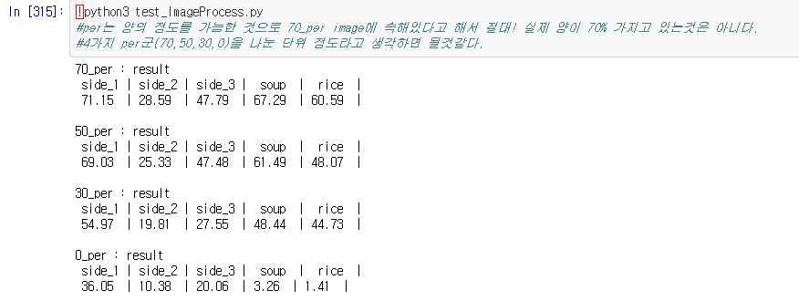
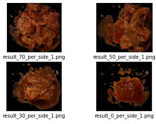
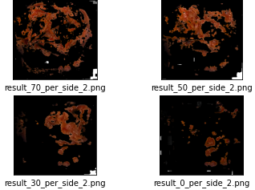

<h1> 📡IoT Part</h1>
장병들의 잔반을 측정하고 Back-End 서버 DB에 데이터를 넣어주는 IoT System

## 🗃목차
### [1.🛠Process 구조](#flow-chart)
### [2.📋Jupyter Notebook(colab)](#음식-분류-알고리즘)
### [3.📊Sequence Diagram](#sequence-diagram)

 
<h2> 🛠Process 구조 </h2>
 
### flow chart

## 📋Jupyter Notebook(colab) 
### 음식 분류 알고리즘
>> cv2.rectangle() 함수와 imshow() 함수를 통해서 사용자에게 식판을 놓을 위치를 알려준다. 
>> 실제 상황에서는 사용자가 3D 구조물에 넣으면 사진이 찍히는 위치에 자연스럽게 놓여진다. 
>> 💡 아래 이미지는 Readme작성을 위해 만든 이미지이며 실제 이미지와는 상이합니다.
 
 
  
 
>> 총 5가지로 분류가 되며 side_1, side_2, side_3, rice, soup로 나뉜다. 
>> 💡 아래 이미지는 Readme작성을 위해 비율을 조절한 이미지로 실제 사진과 비율이 상이합니다.

 
  
>>   분류의 목적은 양 측정 알고리즘에서 Init data와 Target data의 정상적인 매칭을 위해서 이다. 
>>   따라서 Init data와 전체 Target data(side 3가지, main 2가지)를 비교하여 최적의 매칭을 시켜주는 작업이다.  
>> 분류는 크게 아래 2가지 과정을 거친다. 
>>> 1. Side와 Main을 나누는 과정. 
>>>  side는 3가지 반찬을 뜻하며 Main은 밥과 국으로 나뉜다. 
>>>  side[side_1,side_2,side_3] , main[soup,rice]  
>>> 2. 세부적으로 나누는 과정. 
>>>   전체 Init data와 전체 Target data를 역투영 작업을 통해 행렬을 만든다. 
>>>   side의 경우 3X3 행렬 main의 경우 2X2 행렬이 된다. 
>>>   행렬의 Max Weight를 찾는 연산을 하여 Max Weight와 Init data를 Mapping해 양 측정 알고리즘으로 넘긴다. 
>>  
>> 💡 Test Process에는 분류 알고리즘이 들어가지않는다. 자세한 내용은 아래 📌를 참고

📌

 
 >> **📌 Test Process와 Main Process의 차이점** 
 >> Test와 Main의 차이점은 분류 알고리즘의 유무이다. 
 >> 양을 측정하는 알고리즘은 Init data와 Target data를 역투영하여 양을 측정한다. 
 >> 따라서 Init data의 음식와 Target data의 음식이 일치해야하는데. 
 >> 각 사용자의 음식을 담는 순서와 배치법은 상이하기 때문에 어디에 어느 반찬이 있을지 모른다. 
 >> Main에서는 위 분류 알고리즘을 사용하여 배치에 상관없이 확률에 기반하여 해당 음식의 잔반률을 반환한다. 
 >> 하지만 Test Image의 음식 배치는 조절할 수 있기 때문에 분류 알고리즘을 넣을 필요성이 없다. 

 
 
### 양 측정 알고리즘
 
>> 위 음식 분류 알고리즘을 통해 init data와 target data가 정상적으로 Mapping된 상태이다. 
>> 양 측정 알고리즘은 역투영(BackProjection)을 기반으로 만들어진 알고리즘으로 Init data와 Target data를 비교하여 
>> 잔반의 양을 측정하는 알고리즘이다  
>> 양 측정 알고리즘은 총 3가지 과정으로 이루어졌다.
 >>> **1. BackProjection** 
 >>>　　역투영 알고리즘을 적용하는 단계이다 Mapping된 두 Image데이터를 역투영하여 1차 RESULT값을 출력한다.  
 >>>　　1차 RESULT값은 역투영으로 매핑된 부분을 제외한 부분들을 반환하는 값이다. 
 >>> **2. Masking** 
 >>>　　위에서 만들어진 1차 RESULT값들을 threshold함수를 통해 모두 검정색(0,0,0)으로 바꿔주고 thr로 반환한다. 
 >>>　　Target image와 thr을 bitwise_and함수를 통해 Masking 작업 해준다. 
 >>> **3. 비율 측정** 
 >>>　　마스킹된 즉 Image중 RGB(0,0,0)인 부분은 잔반으로 감지가 안된 부분이다.  
 >>>　　따라서 전체 픽셀의 갯수와 RGB(0,0,0)인 픽셀의 갯수를 비교하여 백분율값을 출력하면 잔반을 남긴 양이 된다.  
 

 
  
 
 
  

 
 ___
 
<h3> 음식 분류 알고리즘 및 양 측정 알고리즘 테스트 결과 </h3>
 
 >>[Test Data](https://github.com/osamhack2021/APP_IOT_AI_Meal-Mil-Scan_FOODFIGHTERS/tree/master/osam2021_raspi/asset/test_image)  를 대상으로 알고리즘 실행 결과   
 
 
 >>알고리즘을 적용한 [Result](https://github.com/osamhack2021/APP_IOT_AI_Meal-Mil-Scan_FOODFIGHTERS/tree/master/osam2021_raspi/asset/result_test_image) 값 (잔반 이외의 부분은 검정색(#000000)으로 Masking) 
 
 
 
   

Jupyter Notebook [Jupyter Notebook](https://github.com/osamhack2021/APP_IOT_AI_Meal-Mil-Scan_FOODFIGHTERS/blob/master/osam2021_raspi/test_ImageProcess%20.ipynb) 또는 [Colab](https://colab.research.google.com/drive/18UU9G10e4-TagV8DNqqpHqynXzzTFJOD?usp=sharing)에서 실행해보세요!
 
<h2> 📊Sequence Diagram </h2>

 
### Sequence Diagram 
 

