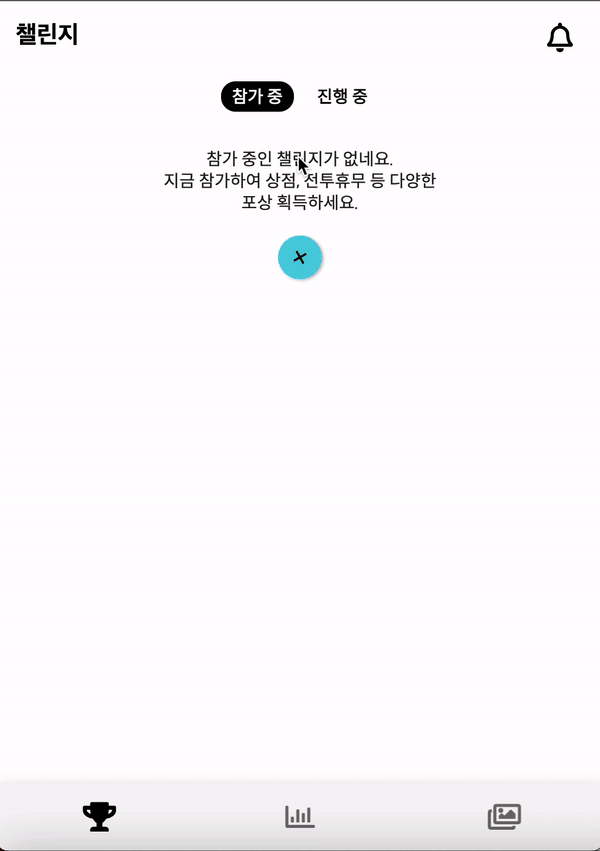
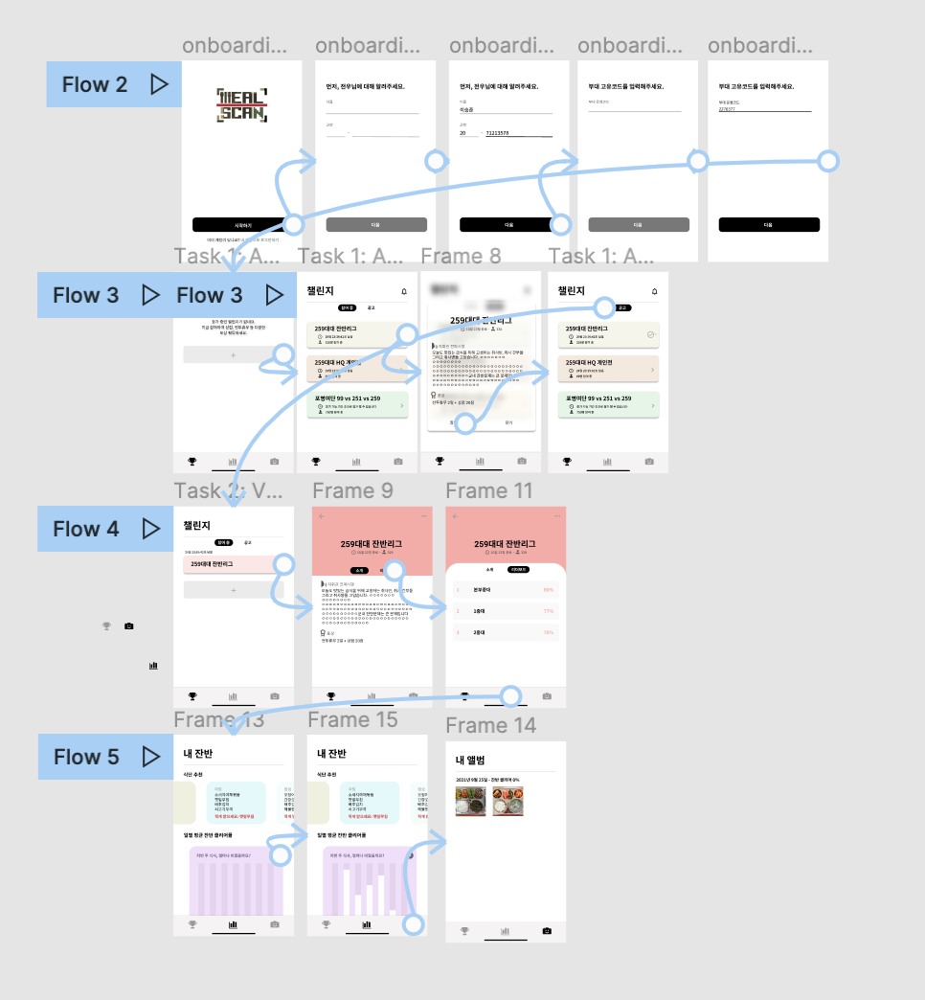
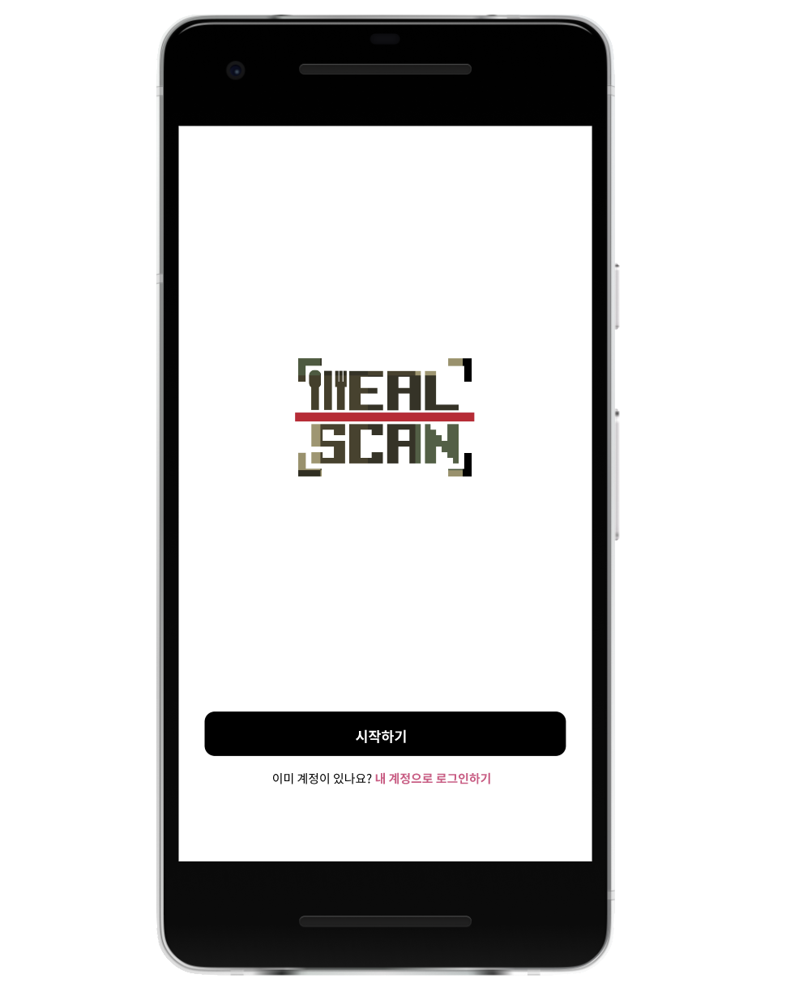

<H3 align="center"> <i> 잔반 줄이기, 이제 즐기세요 </i></H3>


## 프로젝트 소개
밀스캔 (MealScan)은 장병들의 식판 이미지를 이용한 잔반 데이터 분석과 이를 바탕으로한 잔반 챌린지 이벤트를 통해 군 내 잔반 문제를 해결하기 위하여 만들어진 모바일 애플리케이션입니다. 군 음식물 쓰레기가 [역대 최대치](https://www.edaily.co.kr/news/read?newsId=02223846625936528&mediaCodeNo=257)를 경신한 지금, 기존 방식보다 더 편리하고 재치있는 해결법으로 잔반 문제 해결에 한 발짝 더 다가가고자 합니다. 

밀스캔은 세가지 Task로 이루어져 있습니다.
1. 📷 **Scan**\
식사를 마친 후 밀스캔 하드웨어에 식판 및 본인식별 QR을 스캔해주세요. 밀스캔이 전우님의 식판 이미지를 분석하여 해당 식판의 전체적인 잔반 클리어률, 그리고 반찬별 클리어률을 계산합니다.

2. 🥊 **Challenge**\
서비스에 가입하실 때 기입하신 부대고유코드를 바탕으로 전우님이 참가할 수 있는 잔반 챌린지를 제시합니다. 챌린지에 참가하게 되면 챌린지 기간동안 누적된 전우님의 잔반 클리어률이 순위에 반영되고, 최종 우승 시 지휘관이 설정한 포상을 획득하게 됩니다. 챌린지 경쟁자는 개인별, 중대별, 대대별 등 부대 상황과 지휘관 설정에 따라 달라집니다.

2. 📊 **Explore**\
Scan 단계에서의 데이터가 간편하고 보기 쉽게 시각화되어 밀스캔을 통해 확인하실 수 있습니다. 또한 잔반 클리어률을 바탕으로 매 끼니별 배식 추천을 제공하여 배식받을 때나 자율배식 할 때 필요 이상을 받지 않도록 적게 배식받을 메뉴를 추천합니다. 밀스캔 데이터는 국방부와 공유되어 각 군단별 영양사분들이 더 효과적인 식단을 짤 수 있도록 합니다.

## 기능 세부 설명


<table>
        <tbody>
		<tr>
			<td colspan=2>
				<br>
				<b>이제 설문조사 대신 스캔하세요.</b><br>
				<br>
			</td>
		</tr>
		<tr>
            <td rowspan="1"><div align="center"><a href="https://raw.githubusercontent.com/osamhack2021/APP_IOT_MealScan_FOODFIGHTERS
            /Meal_Mil_Scan/assets/images/init.gif"></a></div></td>
            <td width="33%"> 1. (간부) 식사시간 전 initData 생성용 정량 배식된 식판 스캔 </td>
        </tr>
        <tr>
            <td rowspan="1"><div align="center"><a href="https://raw.githubusercontent.com/osamhack2021/APP_IOT_MealScan_FOODFIGHTERS
            /Meal_Mil_Scan/assets/images/qr.gif"></a></div></td>
           <td>2. (병사) 식사 후 본인식별용 QR코드 스캔</td>
        </tr>
        <tr>
            <td rowspan="1"><div align="center"><a href="https://raw.githubusercontent.com/osamhack2021/APP_IOT_MealScan_FOODFIGHTERS
            /Meal_Mil_Scan/assets/images/finished_meal.gif"></a></div></td>
           <td>3. (병사) 잔반 버리기 전 화면 속 규격에 식판 맞추고 스캔 </td>
        </tr>
   </tbody>
</table>


<table>
        <tbody>
		<tr>
			<td colspan=2>
				<br>
				<b>잔반 줄이고 포상도 획득하세요.</b><br>
				<br>
			</td>
		</tr>
		<tr>
            <td rowspan="1"><div align="center"><a href="https://raw.githubusercontent.com/osamhack2021/APP_IOT_MealScan_FOODFIGHTERS
            /Meal_Mil_Scan/assets/images/challenge.gif"></a></div></td>
            <td width="33%"> 챌린지 등록 및 삭제 </td>
        </tr>
        <tr>
            <td rowspan="1"><div align="center"><a href="https://raw.githubusercontent.com/osamhack2021/APP_IOT_MealScan_FOODFIGHTERS
            /Meal_Mil_Scan/assets/images/info.gif"></a></div></td>
           <td>챌린지 정보 확인 (포상, 진행기간 등) </td>
        </tr>
        <tr>
            <td rowspan="1"><div align="center"><a href="https://raw.githubusercontent.com/osamhack2021/APP_IOT_MealScan_FOODFIGHTERS
            /Meal_Mil_Scan/assets/images/leaderboard.gif"></a></div></td>
           <td>리더보드에서 챌린지 최신 순위 확인</td>
        </tr>
   </tbody>
</table>

<table>
        <tbody>
		<tr>
			<td colspan=2>
				<br>
				<b> 잔반 현황 확인하고 다음 식사에 적용하세요. </b><br>
				<br>
			</td>
		</tr>
		<tr>
            <td rowspan="2"><div align="center"><a href="https://raw.githubusercontent.com/osamhack2021/APP_IOT_MealScan_FOODFIGHTERS
            /Meal_Mil_Scan/assets/images/explore.gif"></a></div></td>
            <td width="33%">끼니별 배식량 추천</td>
        </tr>
        <tr>
            <td>다양한 차트 + 애니메이션을 이용한 데이터 시각화 </td>
        </tr>
   </tbody>
</table>

<table>
        <tbody>
		<tr>
			<td colspan=2>
				<br>
				<b> ➕ 내 식판 손쉽게 조회하세요 </b><br>
				<br>
			</td>
		</tr>
		<tr>
            <td rowspan="2"><div align="center"><a href="https://raw.githubusercontent.com/osamhack2021/APP_IOT_MealScan_FOODFIGHTERS
            /Meal_Mil_Scan/assets/images/album.gif"></a></div></td>
            <td width="33%">스캔한 식판 사진 모두 조회</td>
        </tr>
        <tr>
            <td>각 식판 사진별 잔반 클리어률 확인하여 밀스캔 계산의 합리성 확인 </td>
        </tr>
   </tbody>
</table>

<br>

## 기대효과

✨ **장병들의 자발적, 적극적 참여**
* 식단별 배식량을 추천해줌으로서 자연스럽게 병사들의 올바른 배식문화 유도 (넛지효과)
* 챌린지 포상을 통해 동기부여 제공
* 이런 명확한 동기부여로 앱의 지속가능성 확립 (잔반 데이터만 제공하면 사용자 유지율(리텐션)이 낮아질 수 밖에 없음)

💖 **식판 데이터 기반 장병 선호도 파악**
* 매 끼니 데이터를 기반으로하여 기존 월 1회 설문조사 방식보다 정확함
* 해당 데이터를 국방부와 공유하여 호응도에 부응하는 효과적인 식단 편성
* 조사를 무인화, 자동화하여 간부 및 병사의 수고로움를 덜고, 설문조사에 사용되는 종이 낭비를 막아 환경보호까지 일석이조의 효과


<br>

## 발전방향

[온실가스 주범 음식물 쓰레기...연간 885만톤 배출](http://www.greenpostkorea.co.kr/news/articleView.html?idxno=127566)\
[음식물 쓰레기 처리로 연간 8000억 낭비](http://www.hkbs.co.kr/news/articleView.html?idxno=530572)\
['음쓰' 물기 빼기가 경제에 미치는 영향](http://www.ohmynews.com/NWS_Web/View/at_pg_w.aspx?CNTN_CD=A0002725580)


위와 같이 음식물 쓰레기 배출 문제는 군대 뿐만 아니라 사회에서도 주목하는 이슈입니다. 사회 다양한 곳에서 이루어지고 있는 잔반 줄이기 캠페인에도 불구하고, 매일 1만4400톤 가량의 음식물쓰레기가 배출되고 있고, 매년 상승되는 처리비용으로 연간 8000억의 혈세낭비는 더욱 더 증가할 것으로 예상됩니다. 이런 현실 속 밀스캔은 군대 뿐만 아니라 학교 등 국내 다양한 공공기관에서 잔반 챌린지와 데이터 분석을 개시해보고 싶습니다. 기존 포스터 배포나 교육 위주의 방식에서 탈피하여 2021년에 알맞고, MZ세대의 눈높이에 맞춘 데이터 기반의 챌린지 기능과 모바일 앱으로서의 접근성을 가진 밀스캔이 대한민국 음식물 쓰레기 감축의 미래라고 생각합니다. 


## 컴퓨터 구성 / 필수 조건 안내 (Prerequisites)
* ECMAScript 6 지원 브라우저 사용
* 권장: Google Chrome 버젼 77 이상

<br>

## 기술 스택 (Technique Used) 💻 

* **Backend**

|Firebase|
|:---:|
|<a href="https://firebase.google.com/"></a>|

|사용한 오픈소스 패키지 이름|용도 
|:---:|:---:|
|provider (^5.0.0)| 용도
|dropbox_client (^0.8.0) | 용도

* **FrontEnd**  

|Dart|Flutter UI Framework|Figma
|:---:|:---:|:---:|
|<a href="https://dart.dev/"></a>|<a href="https://flutter.dev/"></a>|

<table>
    <tr>
        <td width="50%">
            
        </td>
        <td width="50%">
            
        </td>
    </tr>
    <tr>
        <td align="center">
            <a href="https://www.figma.com/file/p1Ln3TPyICmkYXUJTXS2bI/MealScan?node-id=0%3A1">Figma Viewport</a>
        </td>
        <td align="center">
            <a href="https://www.figma.com/proto/p1Ln3TPyICmkYXUJTXS2bI/MealScan?node-id=9%3A39&scaling=scale-down&page-id=0%3A1&starting-point-node-id=9%3A39&show-proto-sidebar=1">Figma Prototype</a>
        </td>
    </tr>
</table>

|사용한 오픈소스 패키지 이름|용도 
|:---:|:---:|
|font_awesome_flutter (^9.0.0)| 아이콘 사용
|fl_chart (^0.40.0) | Explore를 위한 데이터 시각화
|animated_widgets (^1.1.0) | 챌린지 및 데이터 화면에서 아이콘 탭 유도
|cool_stepper (^1.2.1) | 온보딩 화면 제작
|flutter_swiper_plus () | 데이터 화면 갤러리 형태의 배식추천
|carousel_slider (^4.0.0) | 온보딩 첫 화면 튜토리얼
|photo_view (^0.13.0) | 앨범 탭에서 식판 사진 줌인 줌아웃 가능


* **IOT**  

|Raspberry Pi|Python|
|:---:|:---:|
|<a href="https://www.raspberrypi.org/"></a>|<a href="https://www.python.org/"></a>|

## 설치 안내 (Installation Process)
```bash
$ git clone https://github.com/osamhack2021/APP_IOT_MealScan_FOODFIGHTERS.git
$ cd Meal_Mil_Scan
$ flutter run --web-renderer html -v -d web-server --web-hostname=0.0.0.0
$...lib/main.dart is being served at http://0.0.0.0:*****...
```
```
http://0.0.0.0:XXXXX
```
해당 링크 Ctrl/Command + Click

## 프로젝트 사용법 (Getting Started)
**마크다운 문법을 이용하여 자유롭게 기재**

잘 모를 경우
구글 검색 - 마크다운 문법
[https://post.naver.com/viewer/postView.nhn?volumeNo=24627214&memberNo=42458017](https://post.naver.com/viewer/postView.nhn?volumeNo=24627214&memberNo=42458017)

 편한 마크다운 에디터를 찾아서 사용
 샘플 에디터 [https://stackedit.io/app#](https://stackedit.io/app#)
 
## 팀 정보 (Team Information)
- hong gil dong (hong999@gmail.com), Github Id: gildong999
- kim su ji (suji999@gmail.com), Github Id: suji999

## 저작권 및 사용권 정보 (Copyleft / End User License)
 * [MIT](https://github.com/osam2020-WEB/Sample-ProjectName-TeamName/blob/master/license.md)

This project is licensed under the terms of the MIT license.

※ [라이선스 비교표(클릭)](https://olis.or.kr/license/compareGuide.do)

※ [Github 내 라이선스 키워드(클릭)](https://docs.github.com/en/github/creating-cloning-and-archiving-repositories/creating-a-repository-on-github/licensing-a-repository)

※ [\[참조\] Github license의 종류와 나에게 맞는 라이선스 선택하기(클릭)](https://flyingsquirrel.medium.com/github-license%EC%9D%98-%EC%A2%85%EB%A5%98%EC%99%80-%EB%82%98%EC%97%90%EA%B2%8C-%EB%A7%9E%EB%8A%94-%EB%9D%BC%EC%9D%B4%EC%84%A0%EC%8A%A4-%EC%84%A0%ED%83%9D%ED%95%98%EA%B8%B0-ae29925e8ff4)
