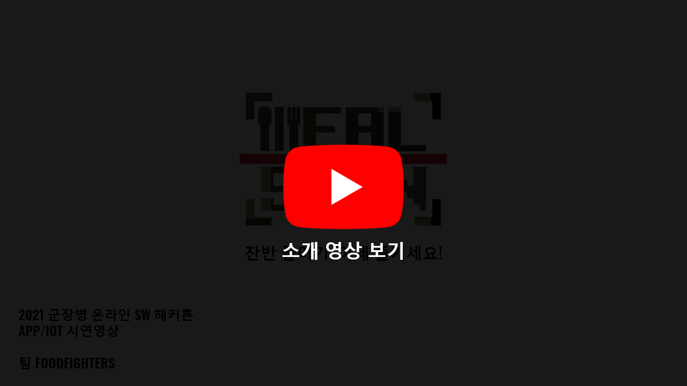
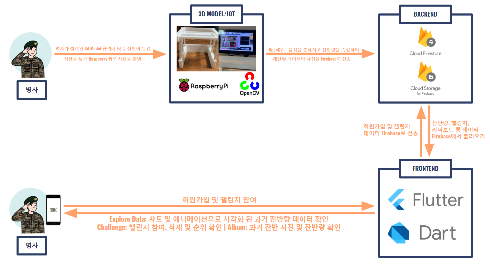
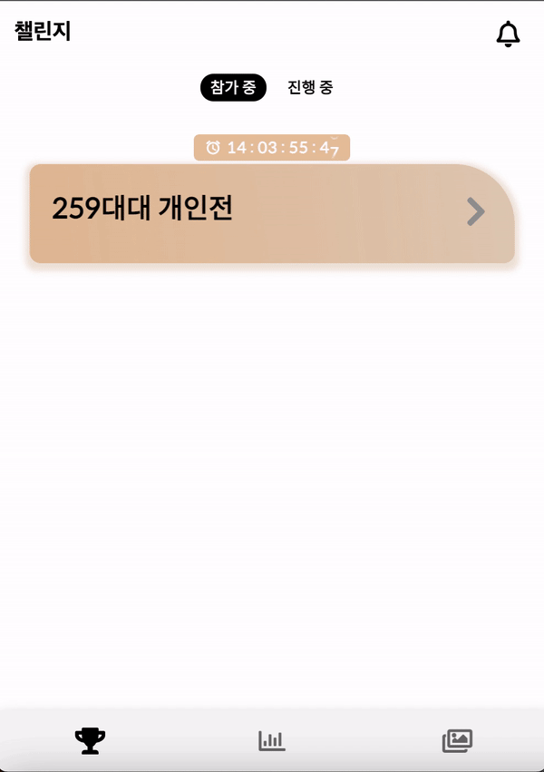
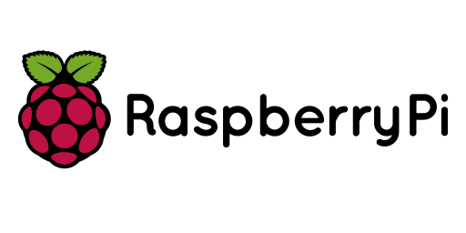
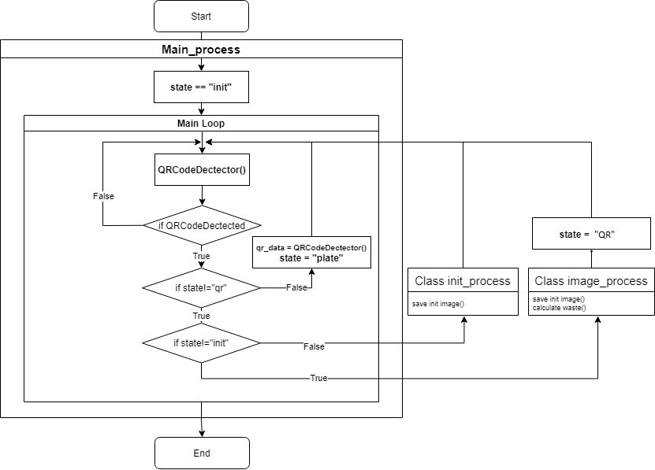
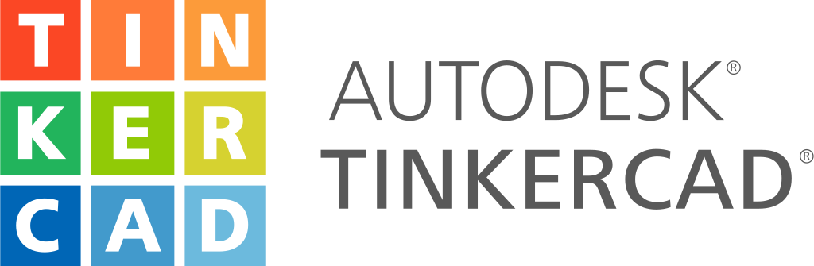
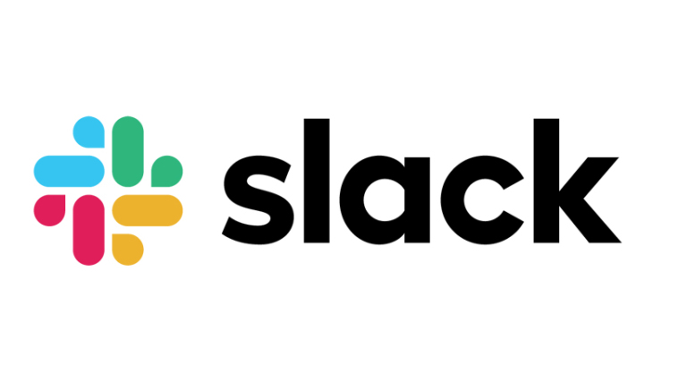

<H3 align="center"> <i> 잔반 줄이기, 이제 즐기세요 </i></H3>
<br>
<br>

<p align="center">
	<a href="https://github.com/osamhack2021/APP_IOT_MealScan_FOODFIGHTERS/search?l=TSX&type=code"></a>
	<a href="https://github.com/osamhack2021/APP_IOT_MealScan_FOODFIGHTERS/graphs/contributors"></a>
	<a href="https://github.com/osamhack2021/APP_IOT_MealScan_FOODFIGHTERS/stargazers"></a>
	<a href="https://github.com/osamhack2021/APP_IOT_MealScan_FOODFIGHTERS/blob/master/license.md"></a>
	
<h2 align="center">프로젝트 설명 자료</h2>

<table>
	<tr>
		<td width="50%">
			<a href="https://www.youtube.com/watch?v=qXpAsFlGKac&ab_channel=%EA%B9%80%EC%84%9D%ED%98%84"></a>
		</td>
		<td width="50%">
			<a href="https://www.youtube.com/watch?v=Oh-SFOLAom0"></a>
		</td>
	</tr>
	<tr>
		<td align="center">
			<a href="https://www.youtube.com/watch?v=qXpAsFlGKac&ab_channel=%EA%B9%80%EC%84%9D%ED%98%84">프로젝트 소개 및 시연영상</a>
		</td>
		<td align="center">
			<a>프로젝트 소개 프레젠테이션</a>
		</td>
	</tr>
</table>

<br>

## 목차(Table of Contents)
1. [프로젝트 소개](#introduction)
2. [앱 기능 세부 설명](#detailedexp)
3. [기대효과](#goals)
4. [발전방향](#forward)
5. [기술스택](#techstack)
    1. [Backend](#backend)
    2. [Frontend](#frontend)
    3. [IOT + Image Processing](#IOT)
    4. [3D Modeling & Printing](#3d)
    5. [Communications/Project Management](#comm)
6. [안드로이드 필수 조건 안내](#prereqs)
7. [설치 안내](#install)
8. [프로젝트 사용법](#start)
9. [팀 정보](#team)
10. [저작권 및 사용권 정보](#license)

<br>

## 프로젝트 소개 <a name="introduction"></a>
밀스캔 (MealScan)은 식판 이미지를 이용한 장병들의 잔반 데이터 분석 및 이를 기반으로 한 잔반 챌린지 이벤트를 통해 군 내 잔반 문제를 해결하기 위하여 만들어진 모바일 애플리케이션입니다. 처리비용만 [연 142억원](http://www.urinews.org/120112), 군 음식물 쓰레기가 [역대 최대치](https://www.edaily.co.kr/news/read?newsId=02223846625936528&mediaCodeNo=257)를 경신한 지금, 기존 방식보다 더 편리하고 재치있는 방식으로 잔반 문제 해결에 한 발짝 더 다가가고자 합니다. 

밀스캔은 세가지 Task로 이루어져 있습니다.
1. 📷 **Scan**\
식사를 마친 후 밀스캔 IoT 시스템에 식판 및 본인식별 QR을 스캔해주세요. 밀스캔이 전우님의 식판 이미지를 분석하여 해당 식판의 전체 잔반 클리어률과 반찬별 클리어률을 계산합니다.

2. 🥊 **Challenge**\
서비스에 가입하실 때 기입하신 부대고유코드에 따라 전우님이 참가할 수 있는 잔반 챌린지를 제시합니다. 챌린지에 참가하게 되면 챌린지 기간동안 누적된 전우님의 잔반 클리어률이 순위에 반영되고, 최종 우승 시 지휘관이 설정한 포상을 획득하게 됩니다. 챌린지 경쟁자는 개인별, 중대별, 대대별 등 부대 상황과 지휘관 설정에 따라 달라집니다.

2. 📊 **Explore**\
Scan 단계에서의 데이터가 밀스캔을 통해 간편하고 보기 쉽게 시각화되어 확인하실 수 있습니다. 또한 반찬별 클리어률을 바탕으로 매 끼니별 배식 추천을 제공하여 배식받을 때 (또는 자율배식 할 때) 필요 이상을 받지 않고, 적게 배식받을 메뉴를 추천합니다. 밀스캔 데이터는 국방부와도 공유되어 영양사분들이 더 효율적인 식단을 짤 수 있게 합니다.


### **전체적인 서비스 플로우**
<table>
    <tr>
        <td width="100%">
            
        </td>
    </tr>
</table>

<br>

## 앱 기능 세부 설명 <a name="detailedexp"></a>


<table>
        <tbody>
		<tr>
			<td colspan=2>
				<br>
				<b>설문조사는 그만! 이제 스캔하세요.</b><br>
				<br>
			</td>
		</tr>
		<tr>
            <td rowspan="1"><div align="center"><a href="https://github.com/osamhack2021/APP_IOT_MealScan_FOODFIGHTERS/blob/master/asset/readme/init.gif"></a></div></td>
            <td width="33%"> 1. (간부) 식사시간 전 initData 생성용 정량 배식된 식판 스캔 </td>
        </tr>
        <tr>
            <td rowspan="1"><div align="center"><a href="https://github.com/osamhack2021/APP_IOT_MealScan_FOODFIGHTERS/blob/master/asset/readme/qr.gif"></a></div></td>
           <td>2. (병사) 식사 후 본인식별용 QR코드 스캔</td>
        </tr>
        <tr>
            <td rowspan="1"><div align="center"><a href="https://github.com/osamhack2021/APP_IOT_MealScan_FOODFIGHTERS/blob/master/asset/readme/finished_meal.gif"></a></div></td>
           <td>3. (병사) 잔반 버리기 전 화면 속 규격에 식판 맞추고 스캔 </td>
        </tr>
   </tbody>
</table>


<table>
        <tbody>
		<tr>
			<td colspan=2>
				<br>
				<b>잔반도 줄이고 포상도 얻고, 일석이조의 챌린지</b><br>
				<br>
			</td>
		</tr>
		<tr>
            <td rowspan="1"><div align="center"><a href="https://github.com/osamhack2021/APP_IOT_MealScan_FOODFIGHTERS/blob/master/asset/readme/challenge.gif"></a></div></td>
            <td width="33%"> 챌린지 등록 및 삭제 </td>
        </tr>
        <tr>
            <td rowspan="1"><div align="center"><a href="https://github.com/osamhack2021/APP_IOT_MealScan_FOODFIGHTERS/blob/master/asset/readme/info.gif"></a></div></td>
           <td>챌린지 정보 확인 (포상, 진행기간 등) </td>
        </tr>
        <tr>
            <td rowspan="1"><div align="center"><a href="https://github.com/osamhack2021/APP_IOT_MealScan_FOODFIGHTERS/blob/master/asset/readme/leaderboard.gif"></a></div></td>
           <td>리더보드에서 챌린지 최신 순위 확인</td>
        </tr>
   </tbody>
</table>

<table>
        <tbody>
		<tr>
			<td colspan=2>
				<br>
				<b> 너 자신을 알라: 잔반 현황 및 식습관 파악하세요. </b><br>
				<br>
			</td>
		</tr>
		<tr>
            <td rowspan="2"><div align="center"><a href="https://github.com/osamhack2021/APP_IOT_MealScan_FOODFIGHTERS/blob/master/asset/readme/explore.gif"></a></div></td>
            <td width="33%">끼니별 배식량 추천</td>
        </tr>
        <tr>
            <td>다양한 차트 + 애니메이션을 이용한 데이터 시각화 </td>
        </tr>
   </tbody>
</table>

<table>
        <tbody>
		<tr>
			<td colspan=2>
				<br>
				<b> ➕ 내 식판 (흑)역사 불러오기, 잔반앨범  </b><br>
				<br>
			</td>
		</tr>
		<tr>
            <td rowspan="2"><div align="center"><a href="https://github.com/osamhack2021/APP_IOT_MealScan_FOODFIGHTERS/blob/master/asset/readme/album.gif"></a></div></td>
            <td width="33%">스캔한 식판 사진 모두 조회 가능</td>
        </tr>
        <tr>
            <td>각 식판 사진별 잔반 클리어률 확인하여 밀스캔 알고리즘의 합리성 확인 </td>
        </tr>
   </tbody>
</table>

<br>

## 기대효과 <a name="goals"></a>

✨ **장병들의 자발적, 적극적 참여**
* 식단별 배식량을 추천해줌으로서 자연스럽게 병사들의 올바른 배식문화 유도 (넛지효과)
* 챌린지 포상을 통해 동기부여 제공
* 잔반 줄이기를 게임화하여 장병들이 잔반 감축을 즐기고 하나의 문화로 인식
* 이런 명확한 동기부여로 앱의 지속가능성 확립 (잔반 데이터만 제공하면 사용자 유지율(리텐션)이 낮아질 수 밖에 없음)

💖 **식판 데이터 기반 장병 선호도 파악**
* 매 끼니 데이터를 기반으로하여 기존 월 1회 설문조사 방식보다 정확함
* 해당 데이터를 국방부와 공유하여 호응도에 부응하는 효과적인 식단 편성
* 스캔만 하면 완료되는 선호도 조사로 기존 종이 설문조사 필요없이 과정을 무인화, 자동화하여 간부 및 병사의 수고로움를 덜고, 설문조사에 사용되는 종이 낭비를 막아 환경보호까지 일석이조의 효과
* 급식 만족도를 높이고 급식 관련 논란 및 갈등을 해결하려는 국방부의 의지를 보여줄 수 있음


## 발전방향 <a name="forward"></a>

[온실가스 주범 음식물 쓰레기...연간 885만톤 배출](http://www.greenpostkorea.co.kr/news/articleView.html?idxno=127566)\
[음식물 쓰레기 처리로 연간 8000억 낭비](http://www.hkbs.co.kr/news/articleView.html?idxno=530572)\
['음쓰' 물기 빼기가 경제에 미치는 영향](http://www.ohmynews.com/NWS_Web/View/at_pg_w.aspx?CNTN_CD=A0002725580)


위와 같이 음식물 쓰레기 배출량 문제는 비단 군대에서만이 아니라 사회 전반에서 주목하는 이슈입니다. 사회 다양한 곳에서 이루어지고 있는 잔반 줄이기 캠페인에도 불구하고, 매일 1만4400톤 가량의 음식물쓰레기가 배출되고 있고, 매년 상승하는 처리비용으로 연간 8000억의 혈세낭비가 있고 더 증가할 것으로 예상됩니다. 이런 현실 속에 밀스캔은 군대, 학교 등 국내 다양한 공공기관에서 잔반 챌린지와 데이터 분석을 개시하는 초석이 될 수 있습니다. 특히 학교는 군대와 급식 환경이 가장 비슷하면서 (배식 및 식사 동선, 취사장 구조) 챌린지 적용이 수월한 단체생활 (반, 학년, 동아리)로 이루어져 밀스캔의 다음 목적지로 적합합니다. 기존 포스터 배포나 교육 위주의 방식에서 탈피하면서 2021년에 알맞고 MZ세대의 눈높이에 맞춘, 데이터 기반의 챌린지 기능과 모바일 앱으로서의 접근성을 가진 밀스캔이 대한민국 음식물 쓰레기 감축의 미래라고 믿어 의심치 않습니다.


<br>

## 기술 스택 (Tech Stack) <a name="techstack"></a>

### **Backend** <a name="backend"></a>

|Firebase|
|:---:|
|<a href="https://firebase.google.com/"></a>|

<table>
    <tr>
        <td width="100%">
            
        </td>
    </tr>
    <tr>
        <td align="center">
            <a>Firebase Structure</a>
        </td>
    </tr>
</table>

#### Backend Dependencies 및 Dir 분류는 [App readme](https://github.com/osamhack2021/APP_IOT_MealScan_FOODFIGHTERS/blob/master/APP(Android)/README.md)에서 확인하세요.

<br>

### **Frontend** <a name="frontend"></a>

|Dart|Flutter UI Framework|Figma
|:---:|:---:|:---:|
|<a href="https://dart.dev/"></a>|<a href="https://flutter.dev/"></a>|<a href="https://www.figma.com/"></a>|

<table>
    <tr>
        <td width="40%">
            
        </td>
        <td width="20%">
            
        </td>
	<td width="40%">
            
        </td>
    </tr>
    <tr>
        <td align="center">
            <a href="https://www.figma.com/file/p1Ln3TPyICmkYXUJTXS2bI/MealScan?node-id=0%3A1">Figma Viewport</a>
        </td>
        <td align="center">
            <a href="https://www.figma.com/proto/p1Ln3TPyICmkYXUJTXS2bI/MealScan?node-id=9%3A39&scaling=scale-down&page-id=0%3A1&starting-point-node-id=9%3A39&show-proto-sidebar=1">Figma Prototype</a>
        </td>
	<td align="center">
            <a>User Flow</a>
        </td>
    </tr>
</table>

#### Frontend Dependencies 및 Dir 분류는 [APP readme](https://github.com/osamhack2021/APP_IOT_MealScan_FOODFIGHTERS/blob/master/APP(Android)/README.md)에서 확인하세요.

<br>

### **IOT + Image Processing** <a name="IOT"></a>

#### ☑️☑️☑️더 자세한 내용과 알고리즘 관련 내용은 [IoT -Raspberry Pi readme](https://github.com/osamhack2021/APP_IOT_MealScan_FOODFIGHTERS/tree/master/IoT(Raspberry%20Pi))를 참고하세요❕❕❕


|Raspberry Pi|Python|OpenCV|
|:---:|:---:|:---:|
|<a href="https://www.raspberrypi.org/"></a>|<a href="https://www.python.org/"></a>|<a href="https://www.opencv.org/"></a>|
<br>

**How to Run**

```bash
$ git clone https://github.com/osamhack2021/APP_IOT_MealScan_FOODFIGHTERS.git
$ cd APP_IOT_MealScan_FOODFIGHTERS.git/IoT(Raspberry Pi)
$ python main.py
```

<table>
    <tr>
        <td width="60%">
            
        </td>
        <td width="40%">
            
        </td>
    </tr>
    <tr>
        <td align="center">
            <a>IOT Flow Chart</a>
        </td>
        <td align="center">
            <a>Image Processing</a>
        </td>
    </tr>
</table>


|사용한 오픈소스 기술|용도 
|:---:|:---:|
|[BackProjection](https://docs.opencv.org/3.4.15/da/d7f/tutorial_back_projection.html)| 잔반 측정 및 Classification 알고리즘에 들어가는 역투영 기술
|[opencv Webcam](https://docs.opencv.org/4.5.3/d8/dfe/classcv_1_1VideoCapture.html)| 라즈베리파이 실시간 잔반 측정을 위한 기술
|[opencv Class index](https://docs.opencv.org/master/annotated.html)| Transfer Colorspace Class (HSV,GRAY,GRB ...)


**오픈소스 및 테스트**\
[Jupyter Notebook](https://github.com/osamhack2021/APP_IOT_MealScan_FOODFIGHTERS/blob/master/IoT(Raspberry%20Pi)/test_ImageProcess_.ipynb) 또는 [Colab](https://colab.research.google.com/drive/18UU9G10e4-TagV8DNqqpHqynXzzTFJOD?usp=sharing)에서 실행해보세요! <br>

<br>

### **3D Modeling & Printing** <a name="3d"></a>

#### ☑️☑️☑️3D Modeling & Printing 관련 자세한 내용은 [IoT - 3D Print readme](https://github.com/osamhack2021/APP_IOT_MealScan_FOODFIGHTERS/tree/master/IoT(3D%20PRINT))를 참고하세요❕❕❕

|Tinkercad|Cura|Ultimaker
|:---:|:---:|:---:|
|<a href="https://www.tinkercad.com/"></a>|<a href="https://ultimaker.com/software/ultimaker-cura"></a>|<a href="https://ultimaker.com//"></a>|

<table>
    <tr>
        <td width="100%">
             
        </td>
    </tr>
    <tr>
        <td align="center">
            <a>3D Model Structure</a>
        </td>
    </tr>
</table>

<br>

### **Communications/Project Management** <a name="comm"></a>

|Github Projects|Slack|
|:---:|:---:|
|<a href="https://github.com/osamhack2021/APP_IOT_MealScan_FOODFIGHTERS/projects/1"></a>|<a href="https://www.slack.com/"></a>|

<table>
    <tr>
        <td width="50%">
            
        </td>
        <td width="50%">
            
        </td>
    </tr>
    <tr>
        <td align="center">
            <a>Github Projects Kanban Board</a>
        </td>
        <td align="center">
            <a>Slack Workspace</a>
        </td>
    </tr>
</table>
<br>


## 안드로이드 필수 조건 안내 (Prerequisites) <a name="prereqs"></a>
* Android 5.0 (Lollipop: API level 21)
* 권장: Android 10.0 (Q: API level 29)

## 설치 안내 (Installation Process) <a name="install"></a>
```bash
$ git clone https://github.com/osamhack2021/APP_IOT_MealScan_FOODFIGHTERS.git

$ cd "APP(Android)"

$ flutter run --web-renderer html -v -d web-server --web-hostname=0.0.0.0

$...lib/main.dart is being served at http://0.0.0.0:*****...
```
```
http://0.0.0.0:XXXXX
```
해당 링크 Ctrl/Command + Click

## 프로젝트 사용법 (Getting Started) <a name="start"></a>
* App은 Web에서 Run하여 사용해보세요!
* Image Processing은 [Jupyter Notebook](https://github.com/osamhack2021/APP_IOT_MealScan_FOODFIGHTERS/blob/master/IoT(Raspberry%20Pi)/test_ImageProcess_.ipynb) 또는 [Colab](https://colab.research.google.com/drive/18UU9G10e4-TagV8DNqqpHqynXzzTFJOD?usp=sharing)에서 실행해보세요!

 
## 팀 정보 (Team Information) <a name="team"></a>

- [김석현 육군 일병](https://github.com/sh0116) E-mail : [seokhyeon116@naver.com](mailto:seokhyeon116@naver.com), **팀장 및 IOT**

- [이승준 육군 상병](https://github.com/seansungjoonlee) E-mail : [slee1040@gmail.com](mailto:slee1040@gmail.com), **Frontend**

- [이형민 육군 일병](https://github.com/alee2022) E-mail : [alee19825@gmail.com](mailto:alee19825@gmail.com), **Backend**

- [박세연 육군 상병](https://github.com/seanpark98) E-mail : [seanpark98@gmail.com](mailto:seyeonpark@berkeley.edu), **Backend-IOT**


## 저작권 및 사용권 정보 (Copyleft / End User License) <a name="license"></a>
 * [MIT](https://github.com/osam2020-WEB/Sample-ProjectName-TeamName/blob/master/license.md)
